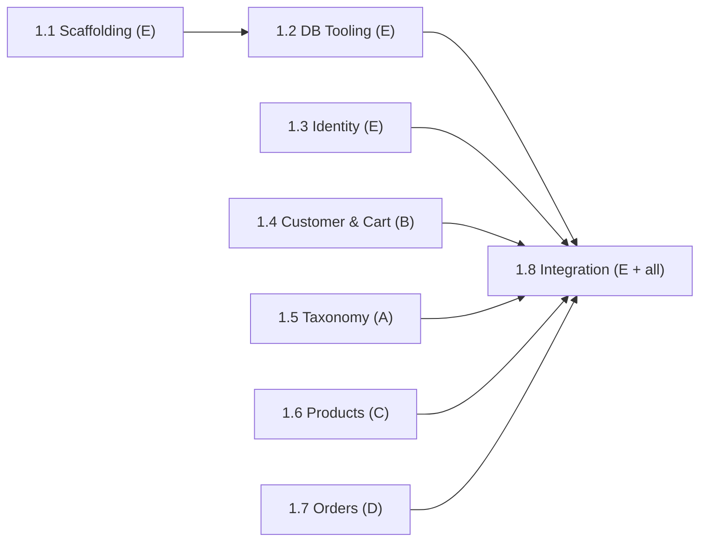

# Phase 1: Project Foundation & Database

> **Status:** In Progress (4 / 8 subphases complete)
> **Lead:** E
> **Members:** A, B, C, D, E — every member owns one database schema subphase
> **Phase Dependencies:** None — this is the starting phase
> **DB Schema Reference:** [DB_Schema.md](../../Database/DB_Schema.md)

---

## Overview

Set up the development environment and bring the database to life. E scaffolds the frontend and backend projects and sets up the database tooling (PostgreSQL container, Flyway, seed runner, `pg.Pool`). Database work — migration SQL, constraints, indexes, and seed data — is split **equally across all 5 members**, each owning one decoupled domain of tables.

---

## What's Done

- Subphase 1.1 (Project Scaffolding) is complete.
- Subphase 1.2 (Database Tooling) is complete.
- Subphase 1.3 (Identity & Location Schema) is complete.
- Subphase 1.6 (Product Schema) is complete.

---

## Subphases

| # | Subphase | Assigned | Depends On | Status |
|---|----------|----------|------------|--------|
| 1.1 | [Project Scaffolding](phase1.1-project-scaffolding.md) | E | — | Complete |
| 1.2 | [Database Tooling (Postgres, Flyway, Seed Runner, pg.Pool)](phase1.2-database-tooling.md) | E | 1.1 | Complete |
| 1.3 | [Identity & Location Schema](phase1.3-identity-location-schema.md) | E | — (1.2 to run locally) | Complete |
| 1.4 | [Customer & Cart Schema](phase1.4-customer-cart-schema.md) | B | — (1.2 to run locally) | Not Started |
| 1.5 | [Catalog Taxonomy Schema](phase1.5-catalog-taxonomy-schema.md) | A | — (1.2 to run locally) | Complete |
| 1.6 | [Product Schema](phase1.6-product-schema.md) | C | — (1.2 to run locally) | Complete |
| 1.7 | [Order, Payment & Delivery Schema](phase1.7-order-payment-delivery-schema.md) | D | — (1.2 to run locally) | Not Started |
| 1.8 | [Migration Integration & Verification](phase1.8-migration-integration-verification.md) | E (lead) + A, B, C, D | 1.2 – 1.7 | Not Started |

### Database Workload Split

| Member | Subphase | Tables (migration + constraints + indexes) | Seed Data |
|--------|----------|---------------------------------------------|-----------|
| **A** | 1.5 | `categories`, `product_categories`, `variant_attributes`, `variant_attribute_values` | 10 categories (with hierarchy), attributes, product↔category links, variant attribute values |
| **B** | 1.4 | `customers`, `addresses`, `carts`, `cart_items` | Sample customer accounts, addresses, carts |
| **C** | 1.6 | `products`, `product_variants`, `product_images` | 40 products, their variants, and product images (heaviest seed) |
| **D** | 1.7 | `orders`, `order_items`, `payments`, `deliveries` | Historical sample orders with payments and deliveries (needed for Phase 9 reports) |
| **E** | 1.3 | `users`, `employees`, `refresh_tokens`, `cities` | Admin user, employees, Texas cities (main + regional) |

---

## Dependency Flow

Subphases 1.3 – 1.7 can be **written in parallel from day one** — the shared contracts below remove any need to wait on each other. They only need 1.2 to be finished to run their SQL locally.

---

## Shared Contracts (All Members MUST Follow)

### Flyway Migration Version Map

Version numbers are **pre-assigned** in foreign-key dependency order so nobody collides. Use exactly these filenames in `backend/db/migrations/`:

| Version | File | Owner |
|---------|------|-------|
| V1 | `V1__create_users.sql` | E |
| V2 | `V2__create_cities.sql` | E |
| V3 | `V3__create_employees.sql` | E |
| V4 | `V4__create_refresh_tokens.sql` | E |
| V5 | `V5__create_customers.sql` | B |
| V6 | `V6__create_addresses.sql` | B |
| V7 | `V7__create_categories.sql` | A |
| V8 | `V8__create_variant_attributes.sql` | A |
| V9 | `V9__create_products.sql` | C |
| V10 | `V10__create_product_variants.sql` | C |
| V11 | `V11__create_product_images.sql` | C |
| V12 | `V12__create_product_categories.sql` | A |
| V13 | `V13__create_variant_attribute_values.sql` | A |
| V14 | `V14__create_carts.sql` | B |
| V15 | `V15__create_cart_items.sql` | B |
| V16 | `V16__create_orders.sql` | D |
| V17 | `V17__create_order_items.sql` | D |
| V18 | `V18__create_payments.sql` | D |
| V19 | `V19__create_deliveries.sql` | D |

New migrations added after Phase 1 take the next free number (V20, V21, …) and must be announced to the team.

### Seed File Order

Seed scripts in `backend/db/seed/` run in filename order after migrations:

| File | Owner | Contents |
|------|-------|----------|
| `01_identity.sql` | E | cities, admin user, employee users + `employees` |
| `02_customers.sql` | B | customer users (`role = 'customer'`) + `customers` + `addresses` |
| `03_taxonomy.sql` | A | `categories`, `variant_attributes` |
| `04_products.sql` | C | `products`, `product_variants`, `product_images` |
| `05_catalog_links.sql` | A | `product_categories`, `variant_attribute_values` |
| `06_carts.sql` | B | `carts`, `cart_items` |
| `07_orders.sql` | D | `orders`, `order_items`, `payments`, `deliveries` |

### Cross-Reference Rule (No Hard-Coded IDs)

Seed files must **never hard-code serial IDs** of rows owned by another member. Look rows up by natural keys instead:
- Users → `email`
- Products → `base_sku`; Variants → `variant_sku`
- Categories → `category_name`; Attributes → `attribute_name`
- Cities → `city_name`

Example: `(SELECT product_id FROM products WHERE base_sku = 'PHN-001')`.

C publishes the list of `base_sku` / `variant_sku` values early in 1.6, and A publishes category and attribute names early in 1.5, so dependent seed files can be written in parallel.

### Schema Change Rule

Any column, constraint, or index not already in [DB_Schema.md](../../Database/DB_Schema.md) must be added to that file in the same change.

---

## Key Decisions & Notes

- **Equal DB workload:** Table ownership was rebalanced to 4 / 4 / 4 / 4 / 3 tables (C has 3 tables but carries the heaviest seed work: 40 products with variants and BYTEA images). Seed data is no longer written by E alone — each member seeds their own tables.
- **Pre-assigned Flyway versions:** Versions are fixed up front in FK order so that the five schema subphases are fully decoupled.
- **Natural-key lookups in seeds:** Prevents breakage when seed order or serial values change.

