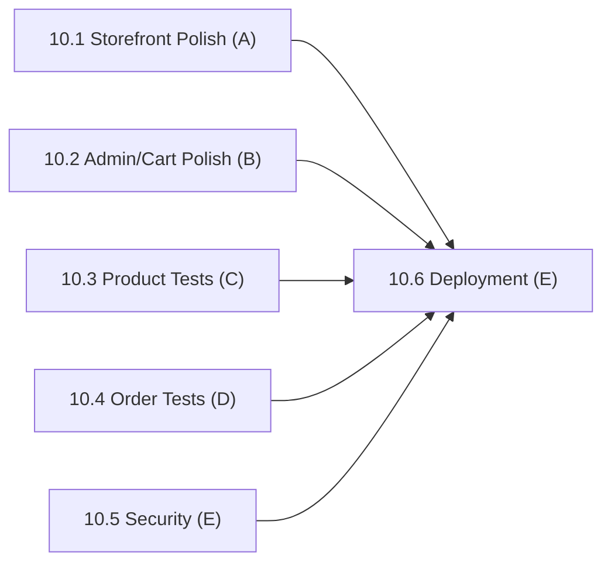

# Phase 10: Polish, Testing & Deployment

> **Status:** Not Started (0 / 6 subphases complete)
> **Lead:** E (deployment)
> **Members:** A, B, C, D, E — each polishes and tests their own area
> **Phase Dependencies:** All previous phases should be substantially complete
> **DB Schema Reference:** [DB_Schema.md](../../Database/DB_Schema.md)

---

## Overview

Final quality pass and go-live preparation. Each member polishes their own area: responsive design, error handling, loading states, validation, and tests. E leads security hardening and production deployment.

---

## What's Done

_Nothing yet._ Update this section as subphases are completed.

---

## Subphases

| # | Subphase | Assigned | Depends On | Status |
|---|----------|----------|------------|--------|
| 10.1 | [Storefront Polish](phase10.1-storefront-polish.md) | A | 4.3, 4.4, 9.4 | Not Started |
| 10.2 | [Admin, Cart & Checkout Polish](phase10.2-admin-cart-checkout-polish.md) | B | 5.6, 6.4, 7.6 | Not Started |
| 10.3 | [Product Backend Validation & Tests](phase10.3-product-backend-validation-tests.md) | C | Phase 4, 7, 9 APIs | Not Started |
| 10.4 | [Order Backend Validation & Tests](phase10.4-order-backend-validation-tests.md) | D | Phase 5, 6, 8 APIs | Not Started |
| 10.5 | [Security Hardening](phase10.5-security-hardening.md) | E | Phase 3, 6.1 | Not Started |
| 10.6 | [Production Deployment](phase10.6-production-deployment.md) | E | 10.1 – 10.5 | Not Started |

---

## Dependency Flow



10.1 – 10.5 run fully in parallel.

---

## Shared Contract: Error Response Format

All backend endpoints (C, D, E) must return errors in this shape:

```json
{ "error": "Short machine-readable message", "message": "Human-readable detail", "statusCode": 400 }
```

---

## Key Decisions & Notes

_Record any implementation decisions, trade-offs, or deviations from the plan here._

