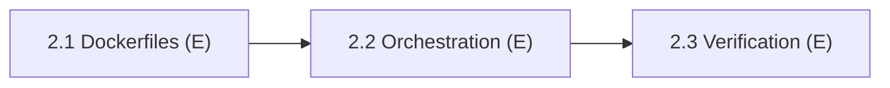

# Phase 2: Full-Stack Dockerization

> **Status:** Not Started (0 / 3 subphases complete)
> **Lead:** E (solo)
> **Members:** E
> **Phase Dependencies:** Phase 1 must be complete (1.8)
> **DB Schema Reference:** [DB_Schema.md](../../Database/DB_Schema.md)

---

## Overview

Containerize every layer of the application for consistent local development. When this phase is done, `docker-compose up` starts the whole stack (database, migrations, seed data, backend API, frontend UI) with hot-reloading.

---

## What's Done

_Nothing yet._ Update this section as subphases are completed.

---

## Subphases

| # | Subphase | Assigned | Depends On | Status |
|---|----------|----------|------------|--------|
| 2.1 | [Development Dockerfiles](phase2.1-development-dockerfiles.md) | E | 1.8 | Not Started |
| 2.2 | [Compose Orchestration & Networking](phase2.2-compose-orchestration-networking.md) | E | 2.1 | Not Started |
| 2.3 | [Stack Verification & Developer Docs](phase2.3-stack-verification-developer-docs.md) | E | 2.2 | Not Started |

---

## Dependency Flow

> [!NOTE]
> Other members are **not blocked** by Phase 2 for local development — they can keep running the frontend/backend with `npm run dev` against the Phase 1 database containers.

---

## Key Decisions & Notes

_Record any implementation decisions, trade-offs, or deviations from the plan here._

