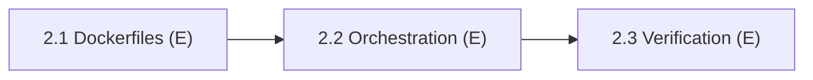

# Phase 2: Full-Stack Dockerization

> **Status:** Complete (3 / 3 subphases complete)
> **Lead:** E (solo)
> **Members:** E
> **Phase Dependencies:** Phase 1 must be complete (1.8)
> **DB Schema Reference:** [DB_Schema.md](../../Database/DB_Schema.md)

---

## Overview

Containerize every layer of the application for consistent local development. When this phase is done, `docker-compose up` starts the whole stack (database, migrations, seed data, backend API, frontend UI) with hot-reloading.

---

## What's Done

- **2.1** `frontend/Dockerfile.dev` and `backend/Dockerfile.dev` (node:20-alpine, hot reload via bind mounts) + `.dockerignore` files; `node_modules` (and `.next`) protected by anonymous volumes.
- **2.2** `docker-compose.yml` runs `db` → `migrations` → `seed` → `backend` → `frontend` using healthchecks and `depends_on` conditions; services reach each other by service name; env loaded from `backend/.env` and `frontend/.env`.
- **2.3** Full stack verified (backend `/api/health` reports DB connected, frontend serves on :3000, nodemon hot reload confirmed). `README.md` documents first run, DB reset, logs, and common errors.

---

## Subphases

| # | Subphase | Assigned | Depends On | Status |
|---|----------|----------|------------|--------|
| 2.1 | [Development Dockerfiles](phase2.1-development-dockerfiles.md) | E | 1.8 | Complete |
| 2.2 | [Compose Orchestration & Networking](phase2.2-compose-orchestration-networking.md) | E | 2.1 | Complete |
| 2.3 | [Stack Verification & Developer Docs](phase2.3-stack-verification-developer-docs.md) | E | 2.2 | Complete |

---

## Dependency Flow

> [!NOTE]
> Other members are **not blocked** by Phase 2 for local development — they can keep running the frontend/backend with `npm run dev` against the Phase 1 database containers.

---

## Key Decisions & Notes

- **Post-completion audit fixes (Oct 2026, E):** A review found that the stack did not actually work end-to-end even though it was marked complete. These fixes were made:
  - **Backend could not reach the DB inside Docker:** `backend/.env` points to `localhost`, so the backend container got `ECONNREFUSED 127.0.0.1:5432`. Fix: the `backend` service now sets `DB_HOST=db`, `DB_PORT=5432` and DB credentials in `environment:`, which overrides `env_file`.
  - **Seed re-ran on every `docker compose up`:** the seeds are not idempotent, and `psql -f` ignores SQL errors, so every restart would have duplicated rows. Fix: the seed service skips when `users` already has rows, and runs each file with `-v ON_ERROR_STOP=1` so a failing seed makes the service exit non-zero. To re-seed, use `docker compose down -v`.
  - **Hot reload on Windows bind mounts:** added `CHOKIDAR_USEPOLLING=true` (backend/nodemon) and `WATCHPACK_POLLING=true` (frontend).
  - **Env files:** the README told users to create `frontend/.env.local`, but compose requires `frontend/.env`, so the README now says `.env`. `backend/.env.example` DB credentials now match the compose defaults (`postgres`/`postgres`/`brightbuy`, host port `5433`).
  - README now covers DB reset, viewing logs, and common errors, as 2.3 requires.

