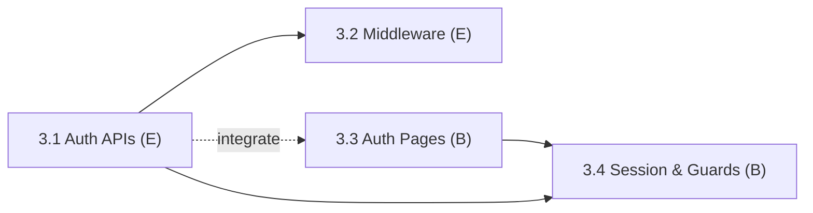

# Phase 3: Authentication System

> **Status:** Complete (4 / 4 subphases complete)
> **Members:** E (backend auth), B (frontend auth UI)
> **Phase Dependencies:** Phase 2 must be complete
> **DB Schema Reference:** [DB_Schema.md](../../Database/DB_Schema.md)

---

## Overview

Build the custom JWT auth flow from scratch. E builds the backend: registration, login, issuing and refreshing tokens, logout, and middleware that protects routes. B builds the frontend: login/register pages, the Zustand auth store, and automatic token refresh.

**Guest browsing:** Product listing and detail pages are public. Cart and checkout require login, and guests are redirected to `/login`.

---

## What's Done

- **3.1 Auth API Endpoints (E):** Implemented custom JWT logic, bcrypt password hashing, and all endpoints (`/register`, `/login`, `/refresh`, `/logout`, `/me`) using `HttpOnly` cookies.
- **3.2 Auth Middleware & Role Guards (E):** Implemented `requireAuth` and `requireRole` middleware to protect routes.

---

## Subphases

| # | Subphase | Assigned | Depends On | Status |
|---|----------|----------|------------|--------|
| 3.1 | [Auth API Endpoints](phase3.1-auth-api-endpoints.md) | E | Phase 2 | Complete |
| 3.2 | [Auth Middleware & Role Guards](phase3.2-auth-middleware-role-guards.md) | E | 3.1 | Complete |
| 3.3 | [Auth Pages & Zustand Store](phase3.3-auth-pages-zustand-store.md) | B | Phase 2 (build against contracts), 3.1 (to integrate) | Complete |
| 3.4 | [Session Handling & Route Protection](phase3.4-session-handling-route-protection.md) | B | 3.3, 3.1 | Complete |

---

## Dependency Flow

B can build 3.3 right away against the API contracts in [phase3.1-auth-api-endpoints.md](phase3.1-auth-api-endpoints.md) using mock responses, then connect it to the real endpoints once 3.1 is done.

---

## Key Decisions & Notes

_Record any implementation decisions, trade-offs, or deviations from the plan here._

