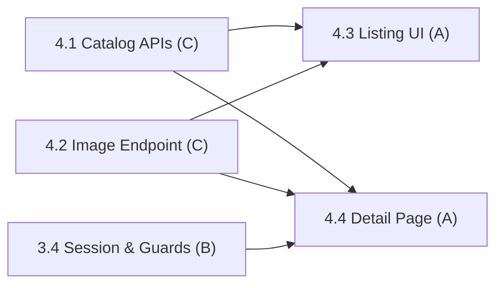

# Phase 4: Product Catalog & Browsing

> **Status:** In Progress (2 / 4 subphases complete)
> **Members:** C (backend APIs), A (frontend storefront UI)
> **Phase Dependencies:** Phase 2 complete; 4.4 also needs 3.4 (auth-aware "Add to Cart" redirect)
> **DB Schema Reference:** [DB_Schema.md](../../Database/DB_Schema.md)

---

## Overview

The core customer-facing storefront. C builds the public backend APIs for product listing, product detail, the category tree, and image serving. A builds the frontend pages: product grid with filters, product detail with a variant selector, and category navigation. All storefront pages are public (guest browsing).

Products and categories with `is_active = false` are excluded from customer-facing results but stay visible in admin views (Phase 7).

---

## What's Done

- Subphase 4.1 (Catalog Read APIs) is complete.
- Subphase 4.2 (Image Serving Endpoint) is complete.

---

## Subphases

| # | Subphase | Assigned | Depends On | Status |
|---|----------|----------|------------|--------|
| 4.1 | [Catalog Read APIs](phase4.1-catalog-read-apis.md) | C | Phase 2 | Complete |
| 4.2 | [Image Serving Endpoint](phase4.2-image-serving-endpoint.md) | C | Phase 2 | Complete |
| 4.3 | [Product Listing, Search & Category Navigation UI](phase4.3-product-listing-search-category-navigation-ui.md) | A | 4.1, 4.2 (can start with mocks) | Complete |
| 4.4 | [Product Detail Page](phase4.4-product-detail-page.md) | A | 4.1, 4.2, 3.4 | Not Started |

---

## Dependency Flow

A can start 4.3 and 4.4 straight away against the contracts in [phase4.1-catalog-read-apis.md](phase4.1-catalog-read-apis.md) and [phase4.2-image-serving-endpoint.md](phase4.2-image-serving-endpoint.md) using mock data.

---

## Key Decisions & Notes

- **Refined dependencies:** The public catalog endpoints (4.1, 4.2) don't need auth, so they only depend on Phase 2. Only 4.4 waits for Phase 3 (3.4) because of the guest "Add to Cart" redirect.
- **Add to Cart wiring:** 4.4 builds the button (disabled at zero stock, guests redirected). The actual `POST /api/cart/items` call is wired by B in [5.4](../Phase5/phase5.4-cart-ui-add-to-cart-wiring.md).

