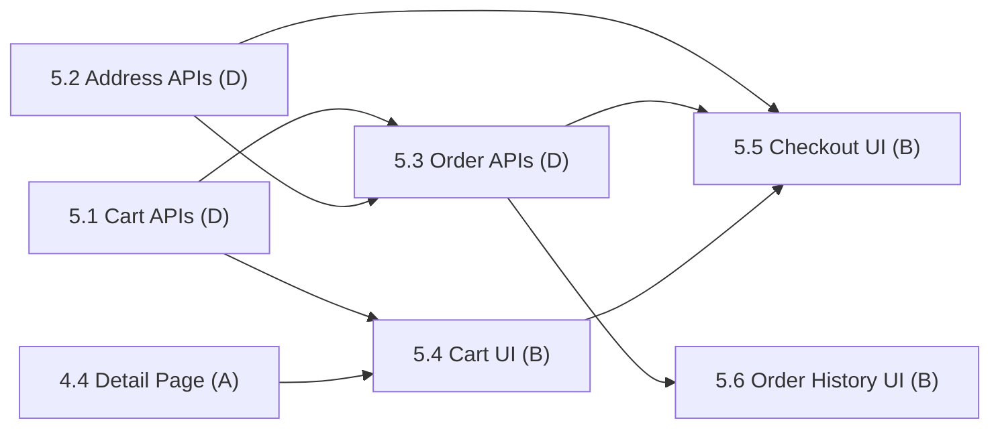

# Phase 5: Shopping Cart & Checkout

> **Status:** In Progress (3 / 6 subphases complete)
> **Members:** D (backend APIs), B (frontend cart/checkout UI)
> **Phase Dependencies:** Phase 3 (auth middleware) and Phase 4 (products/detail page)
> **DB Schema Reference:** [DB_Schema.md](../../Database/DB_Schema.md)

---

## Overview

Let customers build orders and complete purchases. D builds the backend APIs for cart management, addresses, and order placement with atomic stock deduction. B builds the frontend: cart page, address management, checkout flow, and order history. All cart/checkout operations require authentication.

---

## What's Done

- [x] 5.1 Cart APIs (D)
- [x] 5.2 Address & City APIs (D)
- [x] 5.3 Order Placement & History APIs (D)

---

## Subphases

| # | Subphase | Assigned | Depends On | Status |
|---|----------|----------|------------|--------|
| 5.1 | [Cart APIs](phase5.1-cart-apis.md) | D | 3.2 | Complete |
| 5.2 | [Address & City APIs](phase5.2-address-city-apis.md) | D | 3.2 | Complete |
| 5.3 | [Order Placement & History APIs](phase5.3-order-placement-history-apis.md) | D | 5.1, 5.2 | Complete |
| 5.4 | [Cart UI & Add-to-Cart Wiring](phase5.4-cart-ui-add-to-cart-wiring.md) | B | 5.1, 4.4 | Complete |
| 5.5 | [Address Management & Checkout UI](phase5.5-address-management-checkout-ui.md) | B | 5.2, 5.3, 5.4 | Complete |
| 5.6 | [Order History & Detail UI](phase5.6-order-history-detail-ui.md) | B | 5.3 | Complete |

---

## Dependency Flow

B can start UI work against the contracts in each D subphase with mock data while D builds the endpoints.

---

## Business Rules (apply across subphases)

- **Delivery ETA:** 5 business days for Metro Texas cities (`is_main_city = true`), 7 business days for Regional Texas cities (`is_main_city = false`).
- **Delivery modes:** Home Delivery or Store Pickup.
- **Stock validation:** Check stock when the order is placed, not just when an item is added to the cart.
- **Atomic operations:** Stock deduction and order creation happen in a single PostgreSQL transaction. If any variant is short on stock, the whole transaction rolls back.
- **Address snapshot:** Copy the delivery address fields into the `deliveries` table at checkout. Do not reference `addresses` by FK.

---

## Key Decisions & Notes

- **Added `GET /api/cities`** (5.2): the address form needs a city list to choose `city_id`. This endpoint was missing from the original plan.

