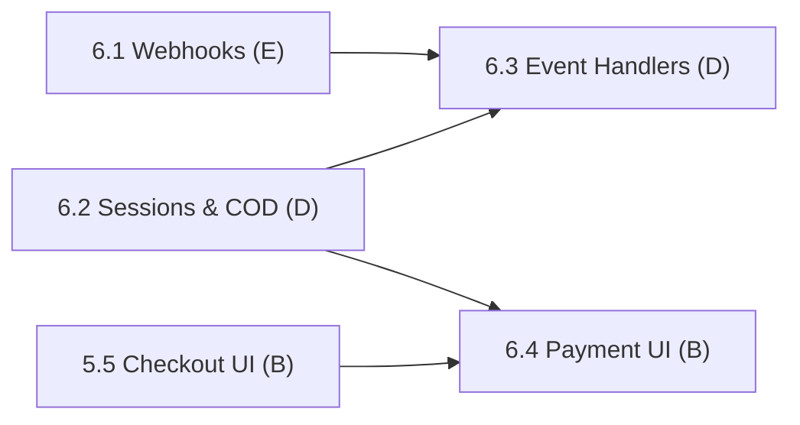

# Phase 6: Payment Integration

> **Status:** In Progress (1 / 4 subphases complete)
> **Members:** D (Lemon Squeezy integration), E (webhook infrastructure), B (payment UI)
> **Phase Dependencies:** Phase 5 must be complete (orders exist to pay for)
> **DB Schema Reference:** [DB_Schema.md](../../Database/DB_Schema.md)

---

## Overview

Connect to Lemon Squeezy to process payments. D creates payment sessions, handles success/failure, updates payment records, and supports Cash on Delivery. E builds the webhook infrastructure: endpoint, signature verification, and routing events. B adds payment method selection and the payment redirect/return pages to checkout.

---

## What's Done

- **6.1 Webhook Infrastructure:** Webhook route implemented with HMAC signature verification and passed to D's handlers.

---

## Subphases

| # | Subphase | Assigned | Depends On | Status |
|---|----------|----------|------------|--------|
| 6.1 | [Webhook Infrastructure](phase6.1-webhook-infrastructure.md) | E | 3.2 | Complete |
| 6.2 | [Payment Sessions & Cash on Delivery](phase6.2-payment-sessions-cash-on-delivery.md) | D | 5.3 | Not Started |
| 6.3 | [Payment Event Handlers & Order Status](phase6.3-payment-event-handlers-order-status.md) | D | 6.1, 6.2 | Not Started |
| 6.4 | [Payment UI](phase6.4-payment-ui.md) | B | 6.2, 5.5 | Not Started |

---

## Dependency Flow



---

## Shared Contract: Webhook → Payment Handler Interface

To keep E's and D's work separate, the webhook router (6.1) calls these functions, which D exports from `backend/src/services/paymentService.js` (6.3):

```js
handlePaymentSuccess({ order_id, transaction_id, amount, raw_event })
handlePaymentFailure({ order_id, transaction_id, reason, raw_event })
```

E can stub these functions until 6.3 is done.

---

## Key Decisions & Notes

- **Added 6.4 Payment UI (B):** The original plan had no frontend work for payments (choosing a method, redirecting to Lemon Squeezy, success/failure return pages). It's assigned to B, who owns the checkout UI.

