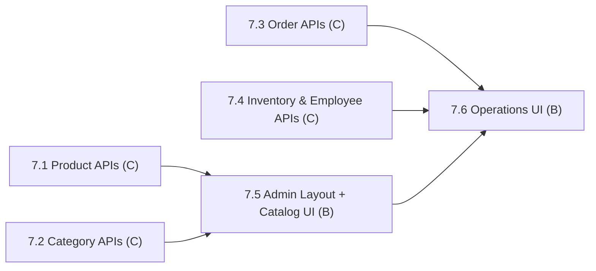

# Phase 7: Inventory & Admin Dashboard

> **Status:** In Progress (3 / 6 subphases complete)
> **Members:** C (backend admin APIs), B (frontend admin UI)
> **Phase Dependencies:** Phase 3 (role guards) and Phase 4 (product APIs). 7.3 also needs Phase 5 (orders).
> **DB Schema Reference:** [DB_Schema.md](../../Database/DB_Schema.md)

---

## Overview

Management tools for employees and administrators. C builds admin-only APIs for product/category/variant CRUD, inventory, order management, and employee administration. B builds the admin dashboard UI. All admin endpoints require the `admin` role.

---

## What's Done

- **7.1 Product, Variant & Image Admin APIs:** Added admin-protected product CRUD, image upload/update/delete, and variant CRUD endpoints under `/api/admin`.
- **7.2 Category Admin APIs:** Added admin-protected category tree CRUD with soft delete and circular hierarchy protection.

---

## Subphases

| # | Subphase | Assigned | Depends On | Status |
|---|----------|----------|------------|--------|
| 7.1 | [Product, Variant & Image Admin APIs](phase7.1-product-variant-image-admin-apis.md) | C | 3.2, 4.1 | Complete |
| 7.2 | [Category Admin APIs](phase7.2-category-admin-apis.md) | C | 3.2 | Complete |
| 7.3 | [Order & Delivery Admin APIs](phase7.3-order-delivery-admin-apis.md) | C | 3.2, 5.3 | Complete |
| 7.4 | [Inventory & Employee Admin APIs](phase7.4-inventory-employee-admin-apis.md) | C | 3.2 | Not Started |
| 7.5 | [Admin Layout & Catalog Management UI](phase7.5-admin-layout-catalog-management-ui.md) | B | 3.4, 7.1, 7.2 | Not Started |
| 7.6 | [Operations Admin UI (Orders, Inventory, Employees)](phase7.6-operations-admin-ui.md) | B | 7.3, 7.4, 7.5 | Not Started |

---

## Dependency Flow

B can start the admin layout and forms in 7.5 with mock data while C builds the APIs.

---

## Key Decisions & Notes

- 7.1 uses a route-local multipart parser for image uploads so no new dependency is required in the current environment. Uploaded image bytes are validated by magic bytes before inserting into `product_images.image_data`.

