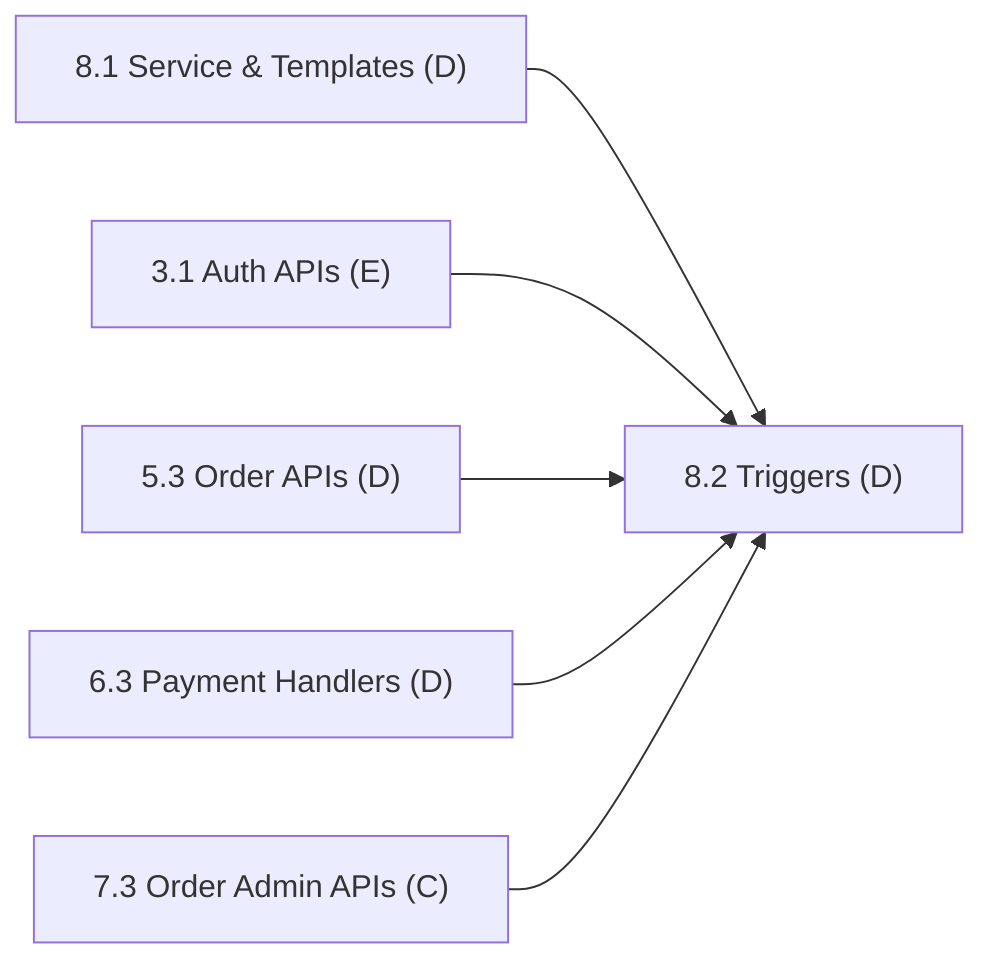

# Phase 8: Email Notifications

> **Status:** Not Started (0 / 2 subphases complete)
> **Members:** D (solo)
> **Phase Dependencies:** Phase 5 (orders). 8.2 also needs 3.1, 6.3, and 7.3 for its triggers.
> **DB Schema Reference:** [DB_Schema.md](../../Database/DB_Schema.md)

---

## Overview

Transactional emails via Nodemailer. D sets up the email service, creates HTML templates, and connects email triggers to existing order, delivery, payment, and auth events. No new API endpoints: emails are triggered from existing backend logic.

---

## What's Done

_Nothing yet._ Update this section as subphases are completed.

---

## Subphases

| # | Subphase | Assigned | Depends On | Status |
|---|----------|----------|------------|--------|
| 8.1 | [Email Service & Templates](phase8.1-email-service-templates.md) | D | Phase 2 | Not Started |
| 8.2 | [Email Triggers Integration](phase8.2-email-triggers-integration.md) | D | 8.1, 3.1, 5.3, 6.3, 7.3 | Not Started |

---

## Dependency Flow

8.1 has no feature dependencies, so D can build it early (for example, while waiting on other members in Phase 6 or 7).

---

## Key Decisions & Notes

- **Cross-owner code:** 8.2 adds email calls inside endpoints owned by E (`/api/auth/register`) and C (`/api/admin/deliveries/:id/status`). D adds a single non-blocking `notificationService` call at the hook point the owner leaves, and the owner reviews the change.

