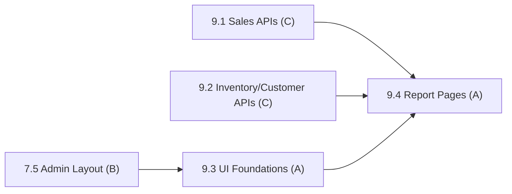

# Phase 9: Reports & Analytics

> **Status:** Not Started (0 / 4 subphases complete)
> **Members:** C (backend report queries/APIs), A (frontend charts/dashboard)
> **Phase Dependencies:** 3.2 (admin guard) and 1.7 seed orders for the APIs; 7.5 (admin layout) for the UI
> **DB Schema Reference:** [DB_Schema.md](../../Database/DB_Schema.md)

---

## Overview

Business intelligence for admins. C writes SQL aggregation queries and exposes them as report APIs. A builds the data visualization UI with charts and CSV export. All report endpoints require the `admin` role.

---

## What's Done

_Nothing yet._ Update this section as subphases are completed.

---

## Subphases

| # | Subphase | Assigned | Depends On | Status |
|---|----------|----------|------------|--------|
| 9.1 | [Sales Report APIs](phase9.1-sales-report-apis.md) | C | 3.2 | Not Started |
| 9.2 | [Inventory & Customer Report APIs + CSV Export](phase9.2-inventory-customer-report-apis-csv-export.md) | C | 3.2 | Not Started |
| 9.3 | [Report UI Foundations](phase9.3-report-ui-foundations.md) | A | 7.5 | Not Started |
| 9.4 | [Report Pages](phase9.4-report-pages.md) | A | 9.1, 9.2, 9.3 | Not Started |

---

## Dependency Flow

---

## Key Decisions & Notes

- **Refined dependencies:** Report APIs only need the admin guard (3.2) and seeded orders (1.7), so C can build them in parallel with Phase 7. Only A's UI waits for the admin layout (7.5).

